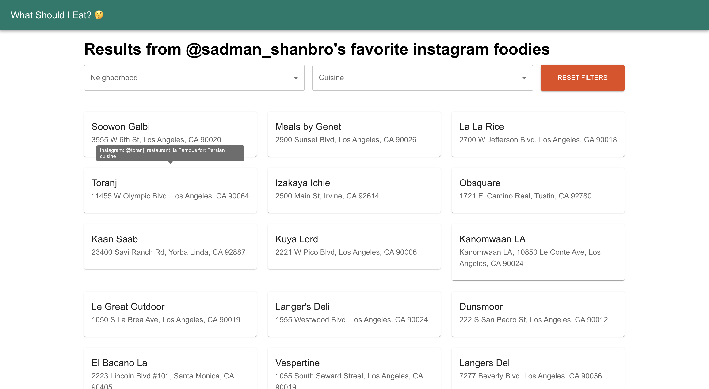

## Overview

Ever find yourself hungry, aimlessly scrolling through Instagram, trying to track down that one magical restaurant the algorithm teased you with earlier? Same here. Even when I do save posts, it's a hassle to find them later, look up the restaurant's location, and figure out what they serve. So, with an hour to kill and my local llama3 model ready to play, I thought, why not automate the whole process?

**I will most likely not continue this project, but I thought it would be fun to share**

## Dataset:

[HuggingFace Dataset](https://huggingface.co/datasets/shanto268/la_restaurants)

## Usage

### Step 1: Scrape Instagram Captions

Run the `caption_scraper.ipynb` notebook to fetch captions from the specified Instagram profiles and save them to JSON files.

### Step 2: Extract Restaurant Information

Run the `restaurant_extractor.ipynb` notebook to extract detailed restaurant information from the saved captions and save the results.

### Step 3: Post-Process Data

Run the `postpro.ipynb` notebook to clean and filter the extracted restaurant data, ensuring it is ready for use.

### Step 4: Spin Up the ~Web App~

Run the `app.py` file to start the Flask server and access the restaurant recommendations via the browser.

---

## Work In Progress:

- [ ] Generate the restaurant recommendations for some of the pages not already processed
- [ ] Make the service text-based/slackbot based?
